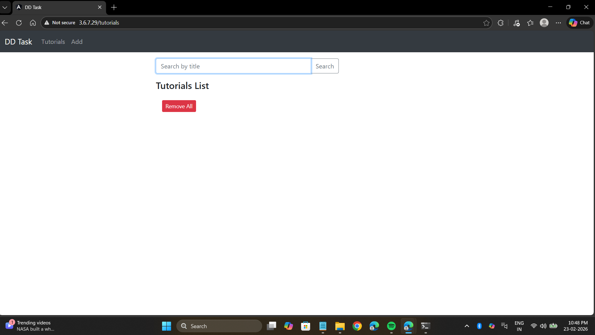
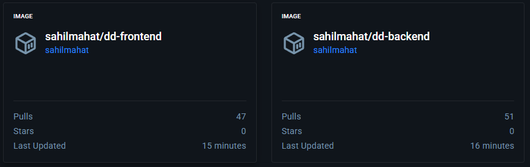

# MEAN Stack DevOps Deployment

This project demonstrates deployment of a full-stack MEAN (MongoDB, Express, Angular 15, Node.js) CRUD application using Docker, Docker Compose, Nginx reverse proxy, and GitHub Actions CI/CD.

---

## Application URL

The application is live at:

http://3.6.7.29

---

## Features

- Create tutorials
- View tutorials
- Update tutorials
- Delete tutorials
- Search tutorials by title

---

## Architecture

The application uses:

- MongoDB (Database container)
- Node.js + Express (Backend container)
- Angular 15 + Nginx (Frontend container)
- Docker Compose (Service orchestration)
- GitHub Actions (CI/CD pipeline)
- AWS EC2 (Deployment server)

Only **port 80** is publicly exposed.

Backend and MongoDB are not publicly accessible.

---

## Docker Setup

Services are managed using Docker Compose.

To run locally:
docker-compose up -d

To stop:
docker-compose down

---

## Reverse Proxy

Nginx is configured to:

- Serve Angular frontend on port 80
- Forward `/api` requests internally to backend

This ensures secure internal communication.

---

## CI/CD Pipeline

On every push to `main` branch:

1. Docker images are built
2. Images are pushed to Docker Hub
3. EC2 server pulls latest images
4. Containers restart automatically

This enables continuous deployment.

---

## Screenshots

## Screenshots

### Application Running

### Docker Containers

### Docker Hub Images

### GitHub Actions Pipeline

---

## Author

Sahil Mahat
